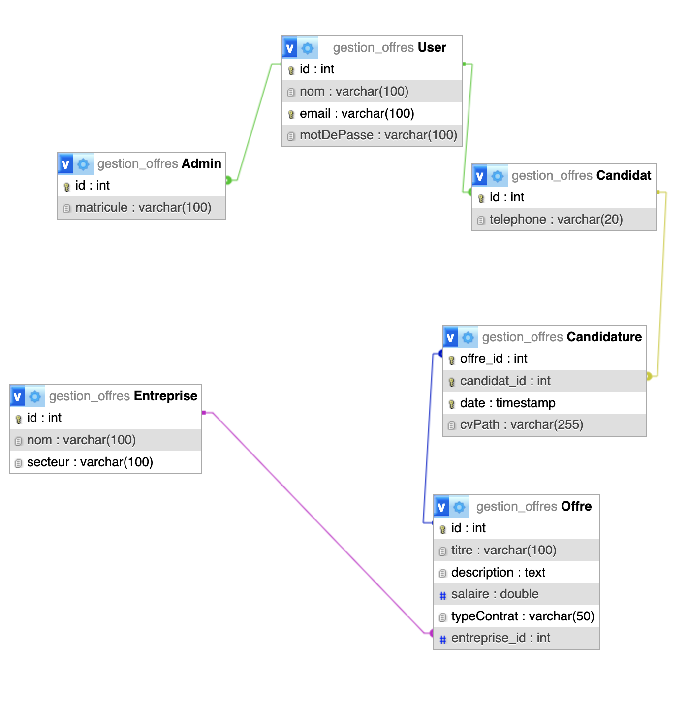
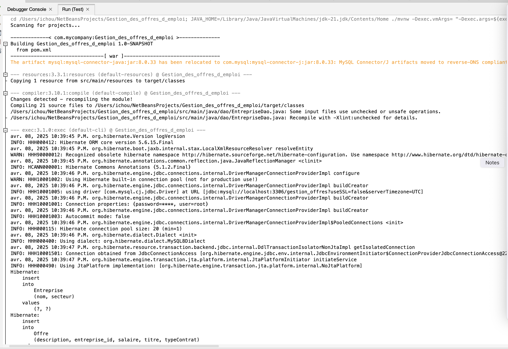
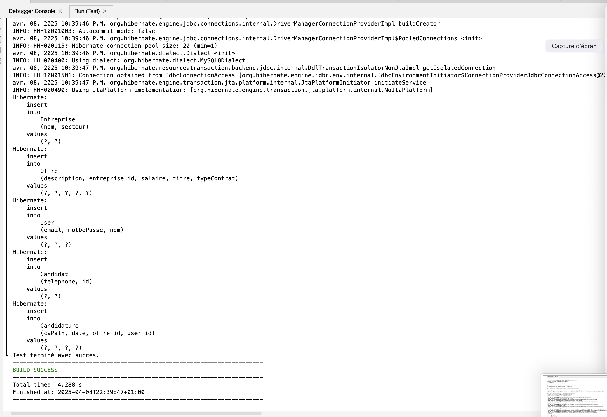
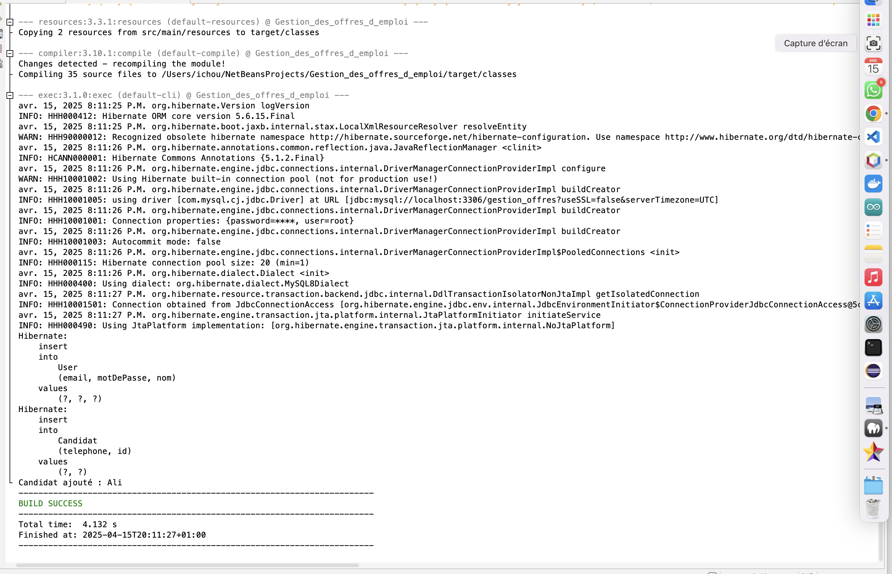
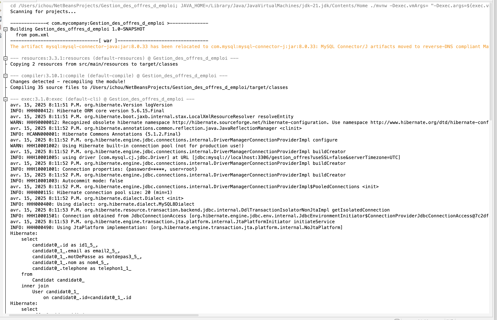
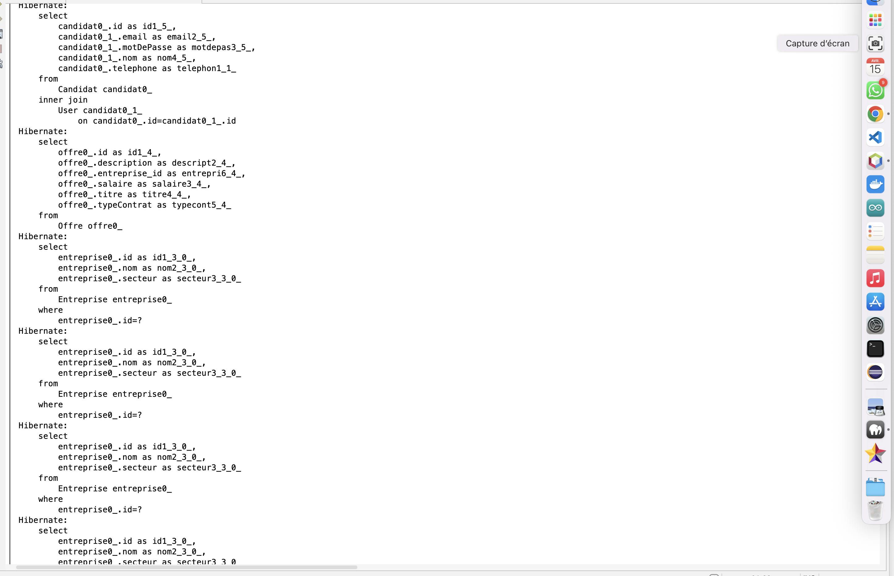
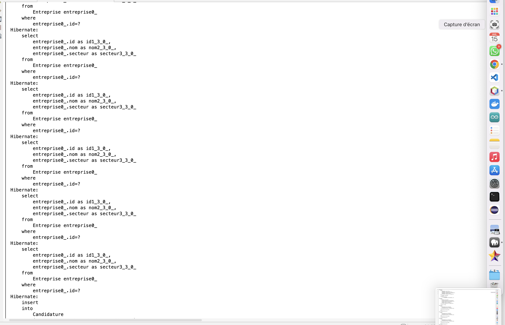
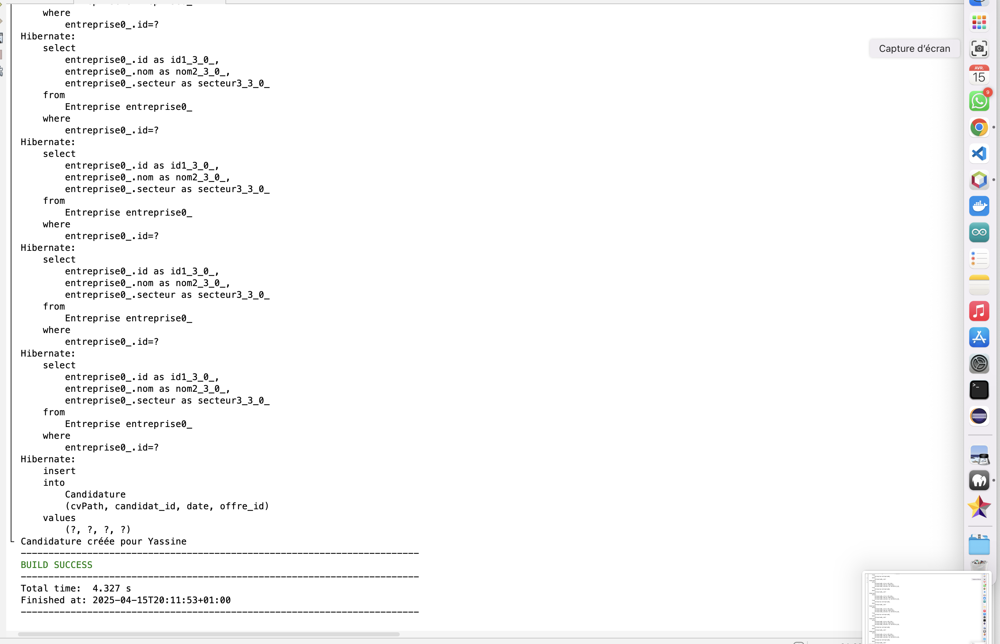
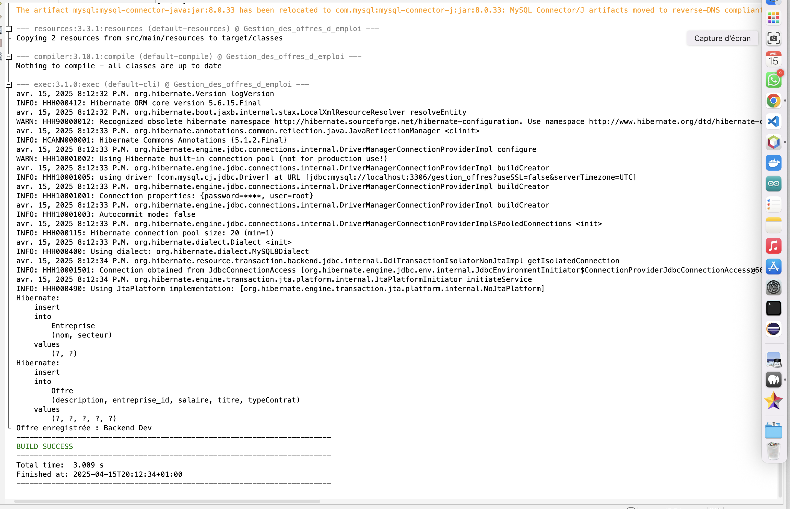

# 💼 Gestion des offres d'emploi

  

## 📘 1. Contexte :  
Ce projet est une application web de gestion des offres d’emploi, permettant aux entreprises de publier des offres, aux candidats de postuler, et aux administrateurs de visualiser les statistiques de candidatures.  
Il vise à faciliter le processus de recrutement à travers une plateforme simple, interactive et efficace.

## ❗ 2. Problématique :  
La gestion traditionnelle des offres d’emploi (emails, formulaires papiers, etc.) engendre un manque d’organisation, de centralisation et de suivi.  
Ce projet répond au besoin de digitaliser le recrutement, d’automatiser les candidatures, et de proposer une interface de suivi en temps réel des statistiques de recrutement.

## 🎯 3. Objectifs :
- Permettre aux entreprises de publier, modifier et supprimer des offres.  
- Permettre aux utilisateurs de consulter les offres et de postuler en ligne avec CV (via AJAX).  
- Offrir un espace candidat pour consulter l’historique des candidatures.  
- Générer des statistiques visuelles sur les candidatures avec Chart.js.  
- Proposer une architecture propre et modulaire respectant les bonnes pratiques (MVC, REST...).

## 🧰 4. Technologies utilisées :

### 🖥️ Frontend :
- **HTML5 / CSS3** – Structure et mise en forme des pages.
- **JavaScript / AJAX** – Interaction dynamique et communication avec le backend.
- **Chart.js** – Visualisation graphique des statistiques de candidatures.
- **Bootstrap** – Pour une interface responsive et moderne.

### ⚙️ Backend :
- **Java** – Langage principal pour la logique métier.
- **Hibernate (ORM)** – Pour la gestion de la persistance des données et les interactions avec la base de données de manière orientée objet.
- **JPA (Java Persistence API)** – Interface standard pour travailler avec Hibernate.
- **JDBC (optionnel)** – Utilisé en complément si nécessaire pour des requêtes spécifiques.

---

### 🗃️ Base de données :
- **MySQL** – Système de gestion de base de données relationnelle pour stocker les données (offres, utilisateurs, candidatures, entreprises...).

## 🧩 5. Diagramme de classes (UML) :

  

## 🗺️ 6.  Modèle conceptuel de la base généré :

  

## 🧪 7. Exécution des tests (console/logs) :

  

  

  

  

  

  

  

  

  

## 🧪 8. Démo video :
[Démonstration](https://github.com/RAFIKAITICHOU/Gestion_des_offres_d_emploi/issues/1#issue-3036531624)

https://github.com/RAFIKAITICHOU/Gestion_des_offres_d_emploi/issues/1#issue-3036531624

https://github.com/RAFIKAITICHOU/Gestion_des_offres_d_emploi/blob/main/D%C3%A9mo%20video/D%C3%A9mo%20video.mp4
[Démonstration](https://github.com/RAFIKAITICHOU/Gestion_des_offres_d_emploi/blob/main/D%C3%A9mo%20video/D%C3%A9mo%20video.mp4)

